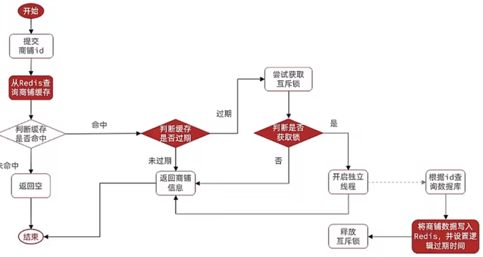
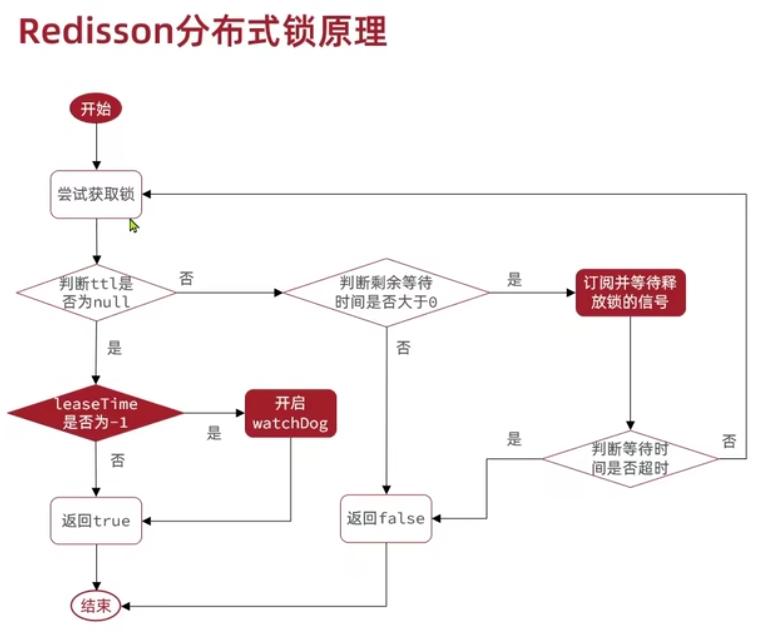

### 缓存更新策略

1.低一致性：redis自带的内存淘汰机制

2.高一致性：主动更新，以超时删除作为兜底

读操作：查询未命中缓存，则写入缓存，加入超时

写操作：先操作数据库再删除缓存，确保这两个的原子性（@Transactional）

### 缓存穿透

客户端请求数据在缓存和数据库都不存在，很多请求会直接打到数据库，造成挤兑

缓存空对象：数据库未命中就缓存“”，设置ttl保证不会有多个未命中请求占用空间。

布隆过滤，在客户端和redis设置布隆过滤，存储数据库的key，如果是不存在的key直接返回

### 缓存雪崩

大量key失效或redis服务器宕机，请求直达数据库

解决：1.不同key，TTL随机值

2.redis集群提高服务可用性

3.缓存业务添加降级限流

4.给业务添加多级缓存

### 缓存击穿

高并发访问并且缓存重建业务复杂的key突然失效，无数请求给数据库巨大压力

解决：1.互斥锁，key缓存重建的过程加锁，保证一致性但会有死锁，setnx实现，如果key不存在就赋值，存在就不

2.逻辑过期，设置字段过期时间，超过这个时间，用另一个线程对key缓存重建，key会一直存在没有ttl



### @Transactional

```
声明事务，方法内操作要么都发生要么都不发生，可以出现错误进行回滚。不保证对数据库操作互斥，假设先使用 select ，然后 update ，即使目标方法使用了 synchronized，但因为提交事务在@Transactional注解方法之外，即使方法执行完成了，但事务还未提交，意味着update 没有生效，若再来一个线程执行 select 就读到了脏数据。
```

### 超卖问题

```
//4.扣减库存，InnoDB引擎会自动给UPDATE、INSERT、DELETE语句添加排他锁，所以通过这样的语句可以防止超卖。
boolean suc = seckillVoucherService.update().setSql("stock = stock-1")
        .eq("voucher_id", voucherId)
        .gt("stock",0).update();//看库存是否大于0解决超卖问题
```

### 一人一单

```
 //一人一单
 Long userId = UserHolder.getUser().getId();
 //防止事务未提交就有线程去查询用户的订单量，所以锁住整个方法
synchronized (userId.toString().intern()){
    //用代理对象去处理事务，否则会事务失效
    IVoucherOrderService proxy  = (IVoucherOrderService) AopContext.currentProxy();
    return proxy.createSeckillVoucher(userId,voucherId);
}
```

### 分布式锁实现

1.set nx ex获取锁，保存线程标识，释放锁先判断当前线程标识是否与redis里一致，调用lua脚本，把判断线程标识和释放锁作为原子操作

2.redisson，实现可重入锁，可重试，实现配置类

```
@Configuration
public class RedissonConfig {
    @Bean
    public RedissonClient redissonClient(){
        Config config = new Config();
        config.useSingleServer().setAddress("redis://192.168.161.128:6379");
        return Redisson.create(config);
    }
}
```

加锁解锁

```
RLock redisLock = redissonClient.getLock("lock:order:" + userId);
boolean isLock = redisLock.tryLock();
if(!isLock){
    return Result.fail("不允许重复下单");
}
try {
    IVoucherOrderService proxy  = (IVoucherOrderService) AopContext.currentProxy();
    return proxy.createSeckillVoucher(userId,voucherId);
} finally {
    redisLock.unlock();
}
```

有看门狗机制每过一段时间就重置有效期，直到锁释放

